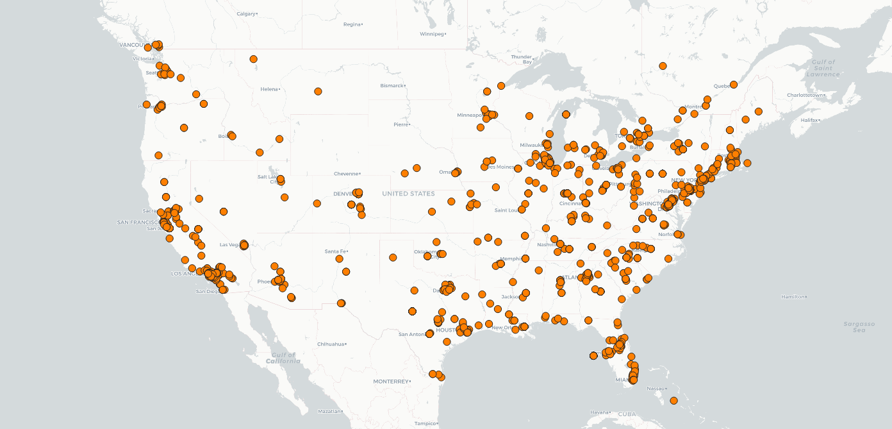
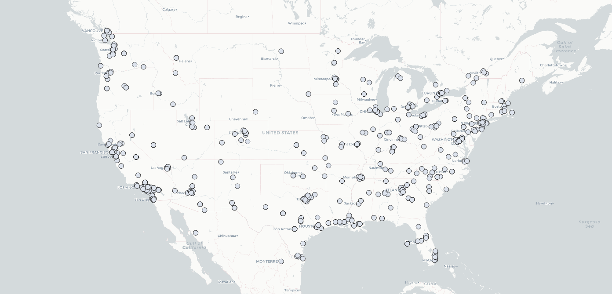
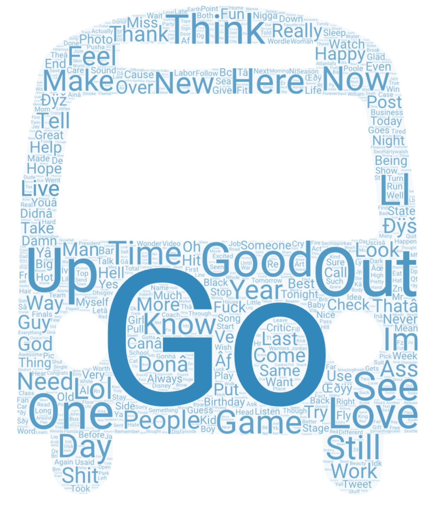

# Geog 458 - Lab 2 - Aaron Thai

1. Introduce your comparison of two places or two time periods. Why do you want to make this comparison? Make sure this narrative will be stored in a readme.md. (POINT 15)

I compared Twitter data from across the continental US in one day (April 21) at 10:45am PST and 9:15pm PST. I wanted to make this comparison because I felt that maybe the topics would be different depending on the time of day. Perhaps people would be more serious during the day and more loose at night. I also wondered if people would leave for work in the morning and then commute back home, which would change their locations slightly.

---

2. Export the two maps to the repository and then insert them to the readme.md. Please compare them and briefly discuss why they represent different geospatial patterns on the map. (POINT 15)

10:45am PST:
 

9:15pm PST:
 

The two maps mostly resemble each other. Points are mostly clustered near urban areas and big metropolitan cities like Seattle, San Francisco, LA, Salt Lake City, Phoenix, Denver, Dallas, Houston, Minneapolis, Chicago, Detroit, New York, DC, Orlando, and Miami. This makes sense as these cities have some of the highest populations in the country and also better internet infrastructure, which makes it more likely to find Twitter users there. 

However, the two maps at not exactly the same. The second map has less dot density then the first, probably because many Twitter users in the US have gone to sleep and are no longer posting. This could be noticed on the East Coast, where the time difference means it is later at night compared to the West Coast. 

Additionally, the points on the second map seem to be even more clustered near major cities compared to the first. This suggests that either people went out to work and returned home to the city (more unlikely in my opinion), or that there are more people who are up late at night in the city working or enjoying themselves (more likely in my opinion).   

---

3. Export the two word clouds to the repository and then insert them to the readme.md. Please compare them and briefly discuss why they represent different context. (POINT 15)

10:45am PST:
 

9:15pm PST:
 

Popular words in the 10:45am wordcloud include: "job," "work," "love," "thank," "go," "out," "look," "see," and "day." From this, I gather that many Twitter users are going out to work at their job. They also seem to have a positive attitude, possibly because they love something they see or are thankful for something they looked at.

Popular words in the 9:15pm wordcloud include:
"go," "out," "up," "think," "love," "good," "day," "game," "make," "new," "see," "here," "now," "still," "work," "feel," "shit," and "ass." From this, I gather that many Twitter users have ended work by then and are going out somewhere after having a good day. Perhaps other users are taking the time to make something new, or discussing a game that they love (I imagine it could be either sports or video games). And finally, it is possible that some users are still at work and are feeling ass or feeling like shit.

Overall, the wordclouds suggest that most Twitter users go out to work in the morning and have a good day. In the evening, many go out to enjoy themselves, but the users who are still at work may be unhappy.